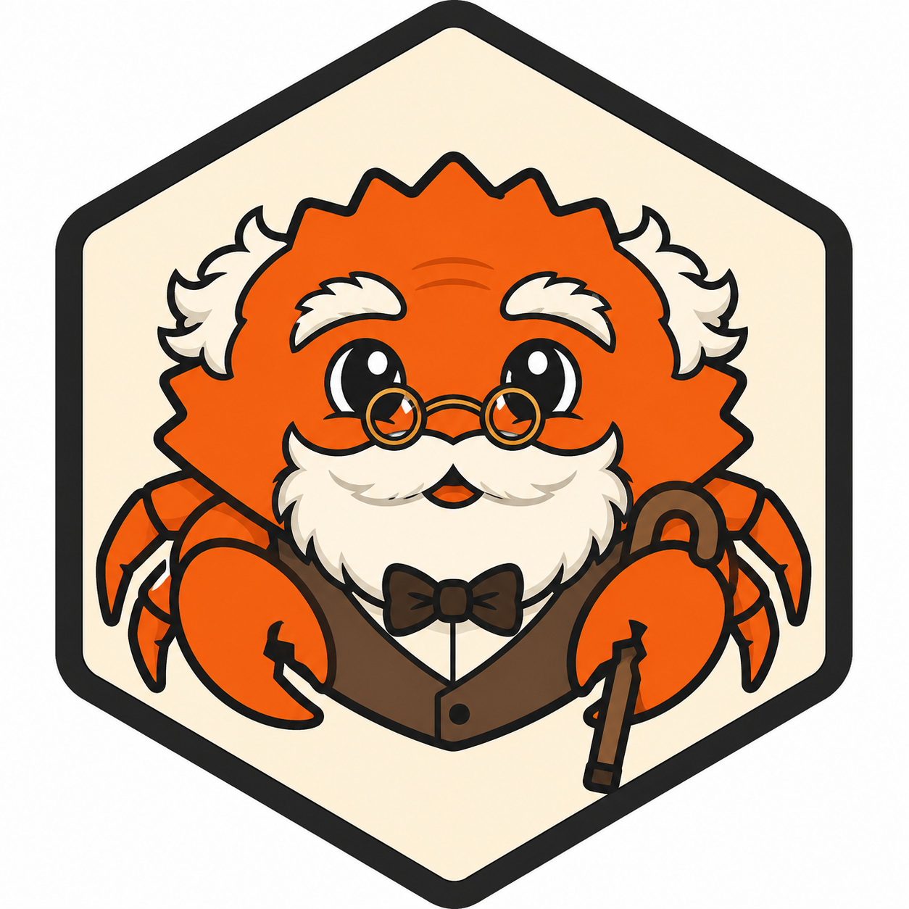

# Clive — a friendly CLI for local LLMs



[](https://crates.io/crates/clive)
[](https://crates.io/crates/clive)
[](https://github.com/SedarOlmez94/clive/actions/workflows/ci.yml)
[](LICENSE)
[](https://www.rust-lang.org/)
[](https://ollama.com/)
[](CONTRIBUTING.md)

Clive is a local-first coding-assistant CLI powered by [Ollama](https://ollama.com/).
It makes open-source LLMs easy to use from the terminal: streaming chat, interactive
coding sessions, model management, safe file editing, and autonomous multi-file agent
workflows — all running on your own machine, with no data leaving your computer.

> **New here?** Jump to [Quick Start](#quick-start) to be chatting with a local model in under five minutes.

## Table of Contents

- [Features](#features)
- [Quick Start](#quick-start)
- [Prerequisites](#prerequisites)
- [Installation](#installation)
- [One-Terminal Onboarding](#one-terminal-onboarding-recommended)
- [Core Commands](#core-commands)
  - [Persistent Configuration](#persistent-configuration)
  - [Ollama Management](#ollama-management-from-clive)
  - [Chat](#chat-single-prompt)
  - [Interactive Session](#interactive-session-multi-turn)
  - [Agent Workflow](#agent-workflow-phase-1-2-3)
  - [Edit & Patch](#patch-mode-unified-diff)
  - [Shell Completions](#professional-cli-features-clap)
- [Configuration Reference](#ollama-host-configuration)
- [How It Works](#how-it-works)
- [Troubleshooting & FAQ](#troubleshooting--faq)
- [Contributing](#contributing)
- [Roadmap](#roadmap)
- [Security](#security)
- [License](#license)
- [Acknowledgements](#acknowledgements)

## Features

- ASCII art banner at startup
- Chat with local Ollama models
- Stream tokens in real time (chat and session)
- Interactive multi-turn coding sessions
- Autonomous multi-file agent workflows
- Manage Ollama from Clive (serve, pull/install, remove)
- Get curated model recommendations by profile
- List installed models and verify connectivity
- Edit source files with preview/apply flow
- Generate unified patches and optionally apply
- Optional git safety checks and auto-stage on write
- Shell completions for bash, zsh, fish, powershell, and elvish
- Non-interactive JSON reports for automation
- Persistent configuration (default model, Ollama URL, system prompt)
- Pipe file contents or command output straight into `chat` via stdin
- Save and reload interactive session history
- Progress spinner while waiting for non-streamed responses

## Quick Start

```bash
# 1. Install Clive (from crates.io once published, or from source)
cargo install clive          # or: cargo install --path .

# 2. Start Ollama in the background
clive ollama serve --detach

# 3. Pull a coding model
clive ollama pull qwen2.5-coder:latest

# 4. Chat!
clive chat "Explain Rust's ownership model in two sentences"

# 5. Or start an interactive session
clive session --model qwen2.5-coder:latest
```

That's it — everything runs locally against your own Ollama instance.

## Prerequisites

- Rust toolchain (`cargo`, `rustc`) — **1.85 or newer**
- [Ollama](https://ollama.com/) installed on your machine

You do not need a separate terminal for Ollama setup once Clive is installed.

## Installation

### From crates.io (recommended once published)

```bash
cargo install clive
```

### From source

```bash
git clone https://github.com/SedarOlmez94/clive.git
cd clive
cargo install --path .
```

The binary is installed to (usually):

```bash
~/.cargo/bin/clive
```

Make sure `~/.cargo/bin` is on your `PATH`.

### Updating

```bash
cargo install clive --force      # or: cargo install --path . --force
```

> **Reinstall after building from source.** The `clive` on your `PATH` is a
> compiled binary — editing the source does not change it until you re-run
> `cargo install --path . --force`.

### Uninstalling

```bash
cargo uninstall clive
```

## One-Terminal Onboarding (Recommended)

1) Start Ollama from Clive in background:

```bash
clive ollama serve --detach
```

2) Verify connection:

```bash
clive doctor
```

3) Install a coding model (example):

```bash
clive ollama pull qwen2.5-coder:latest
```

Clive uses the local Ollama CLI for pulls, so long model downloads stay attached to the terminal and do not time out over HTTP.

4) Confirm model is available:

```bash
clive models
```

5) Start using Clive:

```bash
clive session --model qwen2.5-coder:latest
```

6) Optional: check curated recommendations:

```bash
clive ollama recommend --profile rust
```

## Core Commands

Show help:

```bash
clive --help
```

Set a global default model for all commands:

```bash
export CLIVE_MODEL=qwen2.5-coder:latest
```

Or pass it directly:

```bash
clive -m qwen2.5-coder:latest session
```

If no model is provided, Clive auto-selects your first installed local model. If none are installed, it falls back to `llama3.1`.

Hide startup ASCII art:

```bash
clive --no-banner doctor
```

### Persistent Configuration

Clive can remember your defaults so you don't have to pass flags every time.
Values are stored as JSON at:

- Linux/macOS: `$XDG_CONFIG_HOME/clive/config.json` or `~/.config/clive/config.json`
- Windows: `%APPDATA%\clive\config.json`
- Override with the `CLIVE_CONFIG` environment variable

Precedence for any setting is: CLI flag &gt; environment variable &gt; config file &gt; built-in default.

```bash
# Set persistent defaults
clive config set model qwen2.5-coder:latest
clive config set ollama_url http://127.0.0.1:11434
clive config set system "Be concise and production-focused"

# Inspect current configuration and its location
clive config show
clive config path

# Remove a stored value
clive config unset system
```

### Ollama Management from Clive

Start Ollama in foreground:

```bash
clive ollama serve
```

Start Ollama in background:

```bash
clive ollama serve --detach
```

Install a model:

```bash
clive ollama pull llama3.1
clive ollama pull qwen2.5-coder:latest
```

Recommended models by use-case profile:

```bash
clive ollama recommend --profile coding
clive ollama recommend --profile rust
clive ollama recommend --profile fast
clive ollama recommend --profile reasoning
```

Only show recommendations that are already installed:

```bash
clive ollama recommend --profile coding --installed-only
```

Remove an installed model:

```bash
clive ollama rm qwen2.5-coder:latest
```

List installed models:

```bash
clive models
```

Health check:

```bash
clive doctor
```

### Chat (Single Prompt)

```bash
clive chat "Explain Rust ownership in simple terms"
clive chat "Refactor this function" --model qwen2.5-coder:latest
```

By default, chat streams tokens as they are generated. Disable streaming:

```bash
clive chat "Summarize this module" --no-stream
```

> **Thinking models** (e.g. `qwen3`, `deepseek-r1`) emit their reasoning in a
> separate stream before the final answer. Clive shows this live on stderr as a
> dimmed `[thinking] ...` block so long reasoning phases don't look like a hang,
> then prints the answer on stdout. Redirect stderr (`2>/dev/null`) if you only
> want the final answer.

Optional system prompt:

```bash
clive chat "Create tests for this module" --system "Be concise and production-focused"
```

Pipe file contents or command output directly into the model via stdin.

When you pipe input without a prompt, the piped text becomes the prompt:

```bash
git diff | clive chat "" # or simply: clive chat < notes.txt
clive chat < notes.txt
```

To combine your own prompt with piped input, add the `--stdin` flag (this
keeps the normal `clive chat "message"` case from ever waiting on stdin):

```bash
cat src/main.rs | clive chat "Review this file and suggest improvements" --stdin
git diff | clive chat "Write a concise commit message for this diff" --stdin
```

### Interactive Session (Multi-Turn)

```bash
clive session --model qwen2.5-coder:latest
```

Disable streaming in session mode:

```bash
clive session --model qwen2.5-coder:latest --no-stream
```

Session commands:

- /help shows available commands
- /clear resets conversation context (keeps system instruction)
- /save &lt;file&gt; writes the conversation history to a JSON file
- /load &lt;file&gt; restores a previously saved conversation
- /exit exits the session

### Agent Workflow (Phase 1, 2, 3)

Run an autonomous workflow over specific files:

```bash
clive agent "Refactor error handling and add tests" \
	--files src/main.rs \
	--verify "cargo check -q" \
	--apply
```

Key options:

- `--files` required allow-list of files Clive may edit
- `--verify` repeatable verification commands after apply
- `--apply` writes edits to disk (otherwise preview only)
- `--rollback-on-fail` restores originals if verification never passes
- `--require-clean-git` refuses writes when target files are dirty
- `--profile quick|balanced|strict` adjusts default iteration and verification behavior
- `--max-iterations` overrides profile default loop depth
- `--json` prints machine-readable run report for CI/automation
- `--allow-agent-commands` allows `run_command` actions from the model (disabled by default for safety)

Strict profile example:

```bash
clive agent "Harden CLI argument validation" \
	--files src/main.rs \
	--apply \
	--rollback-on-fail \
	--profile strict
```

Automation-friendly JSON mode:

```bash
clive --no-banner agent "Improve docs" \
	--files README.md \
	--json
```

Enable command actions when you explicitly trust the run context:

```bash
clive agent "Run formatter and fix lint issues" \
        --files src/main.rs \
        --apply \
        --allow-agent-commands \
        --verify "cargo check -q"
```
Apply changes:

```bash
clive edit src/main.rs "Add structured logging and stronger error handling" --write
```

Create backup before write:

```bash
clive edit src/main.rs "Add structured logging" --write --backup
```

Git-aware write protection:

```bash
clive edit src/main.rs "Refactor parsing logic" --write --require-clean-git
```

Auto-stage after write:

```bash
clive edit src/main.rs "Refactor parsing logic" --write --stage
```

### Patch Mode (Unified Diff)

Show unified patch instead of line-marked diff:

```bash
clive patch src/main.rs "Extract helper functions"
```

Apply patch result to file:

```bash
clive patch src/main.rs "Extract helper functions" --write
```

## Professional CLI Features (Clap)

Clive uses a polished Clap configuration with:

- command aliases (for example: ask, ls, health, repl)
- inferred subcommands
- strict help behavior when commands are missing
- global model selection via `-m` and `CLIVE_MODEL`
- typed shell completion generation

Generate shell completions:

```bash
clive completions bash > ~/.clive-complete.bash
clive completions zsh > ~/.clive-complete.zsh
clive completions fish > ~/.config/fish/completions/clive.fish
```

## Verification Before Release

Run these checks before cutting a release:

```bash
cargo fmt --check
cargo check
cargo test
```

## Ollama Host Configuration

Default:

- http://127.0.0.1:11434

Override per command:

```bash
clive --ollama-url http://127.0.0.1:11434 chat "hello"
```

Or via environment variable:

```bash
export OLLAMA_HOST=http://127.0.0.1:11434
```

## VS Code Workflow Notes

Run Clive from your project root for best relative path behavior.

When you run edit or patch with --write, Clive updates files directly and VS Code reflects changes automatically.

## How It Works

Clive is a thin, safety-focused wrapper around a local Ollama server:

```text
┌──────────┐    JSON / streaming     ┌──────────────┐    inference    ┌─────────────┐
│  clive   │ ─────────────────────▶  │ Ollama server │ ───────────────▶│ local model │
│  (CLI)   │ ◀─────────────────────  │ (HTTP :11434) │ ◀───────────────│ e.g. qwen3  │
└──────────┘   tokens / thinking      └──────────────┘                 └─────────────┘
```

- **Chat & session** call Ollama's `/api/chat` endpoint. Responses stream token
  by token; reasoning ("thinking") models are surfaced live so long thinking
  phases never look like a hang.
- **Model management** (`serve`, `pull`, `rm`, `models`) shells out to the local
  `ollama` CLI or talks to the HTTP API, whichever is more reliable for the task.
- **Edit / patch / agent** load your files, ask the model for a full updated
  version, show a diff, and only write when you explicitly pass `--write` /
  `--apply`. Optional git checks and rollback keep changes reversible.

Everything runs on your machine. No prompts, code, or files are sent to any
third-party service.

## Troubleshooting & FAQ

**Clive seems to hang with no output when I send a message.**
You are almost certainly using a *thinking* model (e.g. `qwen3`, `deepseek-r1`).
These models stream their reasoning before the final answer. Clive shows this as
a dimmed `[thinking] …` block on stderr. If you want only the answer, redirect
stderr: `clive chat "…" 2>/dev/null`. If you built from source, also make sure
you reinstalled: `cargo install --path . --force`.

**`clive: command not found`.**
Ensure `~/.cargo/bin` is on your `PATH`. Add this to your shell profile:
`export PATH="$HOME/.cargo/bin:$PATH"`.

**`Ollama not reachable` / connection refused.**
Start the server with `clive ollama serve --detach`, then verify with
`clive doctor`. If you run Ollama on a non-default host or port, set
`--ollama-url` or the `OLLAMA_HOST` environment variable.

**How do I set a default model so I don't pass `--model` every time?**
`clive config set model qwen2.5-coder:latest`, or export `CLIVE_MODEL`.

**Which models should I use?**
Run `clive ollama recommend --profile coding` (or `rust`, `fast`, `reasoning`).

**Can I pipe input into Clive?**
Yes: `git diff | clive chat "write a commit message" --stdin`, or
`clive chat < notes.txt`.

**Does Clive send my data anywhere?**
No. Clive only talks to your local Ollama server.

## Contributing

Contributions are very welcome — bug reports, feature ideas, docs, and code.

1. Read the [Contributing Guide](CONTRIBUTING.md) and
   [Code of Conduct](CODE_OF_CONDUCT.md).
2. Fork the repo and create a feature branch.
3. Make your change with tests where practical.
4. Run the full check suite before opening a PR:

```bash
cargo fmt --all
cargo clippy --all-targets -- -D warnings
cargo test
```

5. Open a pull request describing the change and its motivation.

Good first issues are labelled [`good first issue`](https://github.com/SedarOlmez94/clive/labels/good%20first%20issue).

## Roadmap

Planned and under consideration (feedback welcome via issues):

- [ ] Configurable model parameters (temperature, context length, `num_ctx`)
- [ ] Multi-file context in `chat`/`session` (attach files as context)
- [ ] Prebuilt release binaries via GitHub Releases (no Rust toolchain needed)
- [ ] Homebrew formula and other package-manager distributions
- [ ] Session transcripts in Markdown, not just JSON
- [ ] Pluggable prompt templates / personas

See the [open issues](https://github.com/SedarOlmez94/clive/issues) for the
current list.

## Security

Clive edits files and can run shell commands (only with `--apply` +
`--allow-agent-commands`). Please review the [Security Policy](SECURITY.md)
before reporting a vulnerability, and **do not** open public issues for security
problems.

## License

Licensed under the [MIT License](LICENSE).

Unless you explicitly state otherwise, any contribution intentionally submitted
for inclusion in Clive by you shall be licensed as MIT, without any additional
terms or conditions.

## Acknowledgements

- [Ollama](https://ollama.com/) for making local model hosting effortless.
- [clap](https://github.com/clap-rs/clap) for the ergonomic CLI framework.
- [reqwest](https://github.com/seanmonstar/reqwest), [serde](https://serde.rs/),
  [anyhow](https://github.com/dtolnay/anyhow), and
  [similar](https://github.com/mitsuhiko/similar) for doing the heavy lifting.
- Everyone building and sharing open-source models. ❤️

---

If Clive is useful to you, please consider giving the repo a ⭐ — it helps others
discover the project.

